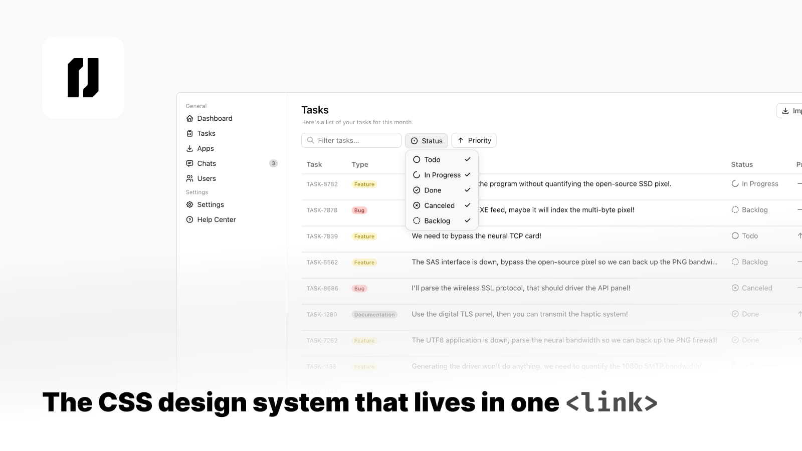

# @erikt/ui

**[Documentation](https://erikthq.github.io/ui/)**

[](https://erikthq.github.io/ui/)

CSS cascade layers, custom properties, `color-mix()`, `light-dark()`, anchor positioning, and the Popover API have collectively closed most of the gap that large UI libraries were built to fill. @erikt/ui takes that foundation and adds a focused component layer on top. A single stylesheet that styles native HTML elements without requiring a component model, a compiler, or a runtime.

```html
<link rel="stylesheet" href="https://esm.sh/@erikt/ui@0.0.5/ui.css" />
```

- 🗂️ **One file**
- 🏷️ **No class names required**
- ⚔️ **Your styles always win**
- 🌗 **Dark mode built in**
- 🎨 **Themeable**
- 📐 **Zero layout opinions**
- 🤖 **AI-ready**

## License

MIT
